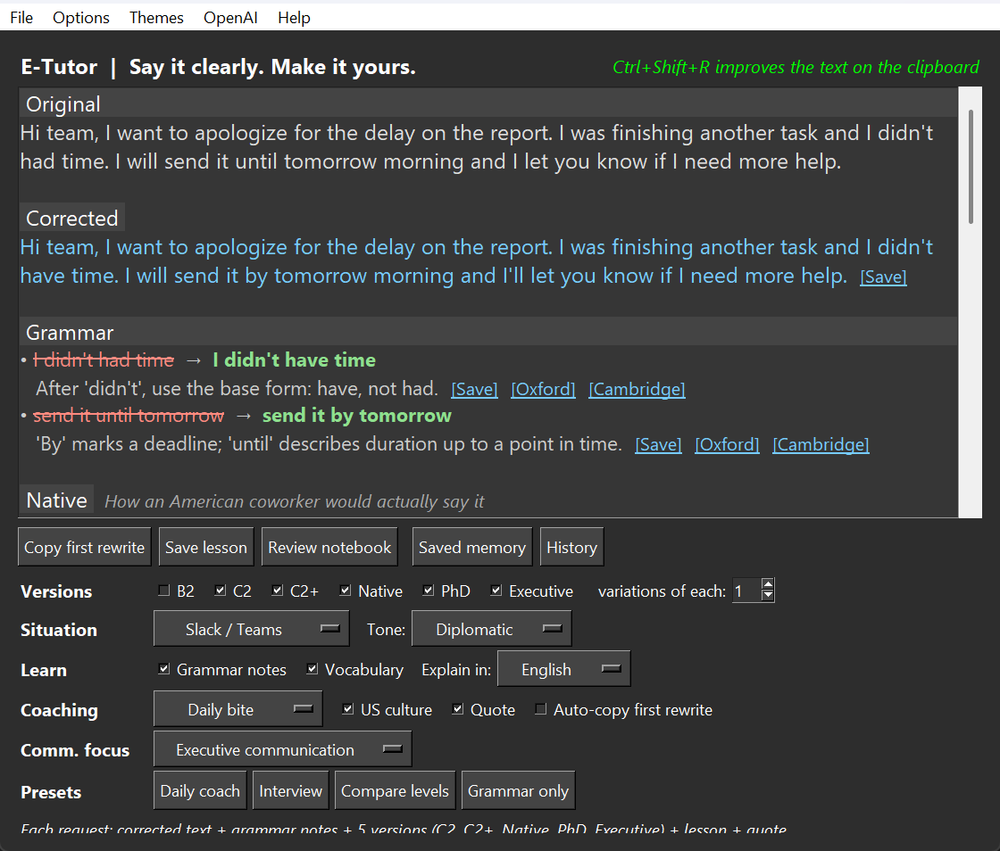
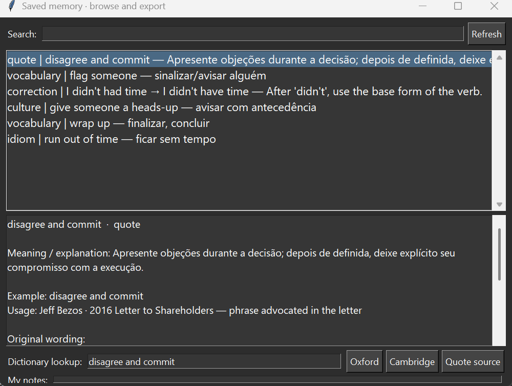
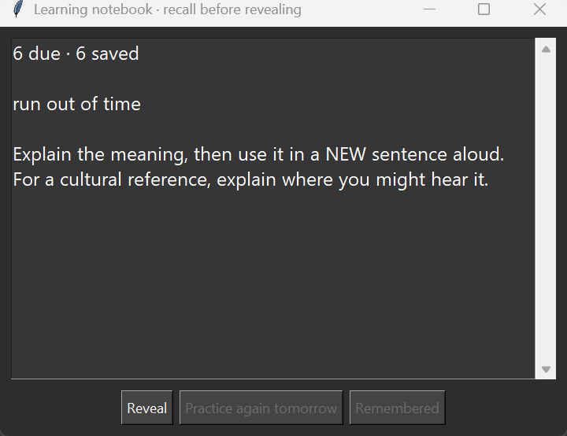

# E-Tutor

[](COPYING.LESSER)

An English coach for Brazilian Portuguese speakers who use English at work and in everyday life. Turn real messages into clear rewrites, small vocabulary and culture lessons, and practice you can revisit. It uses OpenAI GPT models or an OpenAI-compatible endpoint such as Azure AI Foundry.

Copyright (c) 2025-2026 Eduardo Correia <ecorreia@apliant.com.br>

See [QUICKSTART.md](QUICKSTART.md) to get running in a few minutes.

## Screenshots

E-Tutor turns any message you write into a private English coaching session: it corrects your text, rewrites it the way a native or an executive would say it, teaches you the vocabulary behind each version, and schedules it all for review the next morning, without ever leaving your keyboard.

| Daily coaching | Saved memory | Review notebook |
| --- | --- | --- |
| [](doc/screenshot/main-window.png) | [](doc/screenshot/saved-memory.png) | [](doc/screenshot/review-notebook.png) |
| Correction, grammar notes, native and executive rewrites, a short lesson and a sourced quote. | Browse, search and export every saved card, with dictionary links and personal notes. | Recall before revealing, then self-rate with spaced repetition. |

## Features

- **Corrected text** first: your own sentence with only the mistakes fixed
- **Grammar notes**: each mistake as ~~wrong~~ → **right**, with a one-line reason in Portuguese or English
- **Versions to compare**: B2, C2, C2+ (educated, nuanced, concise), Native, PhD and Executive. New installations default to Native + Executive, with 1 to 3 variations of each. Existing choices are preserved; choose `Daily coach` to adopt the new daily workflow. C2+ is an app label; Native, PhD and Executive are styles, not official proficiency levels
- **Vocabulary** worth learning from each version (phrasal verbs, idioms, constructions), with meanings; basic words are skipped
- **Situation**: meeting, Slack/Teams, email, presentation, small talk, job interview, everyday US life. Tone includes neutral, friendly, assertive, diplomatic, apologetic and enthusiastic
- **Presets**: `Daily coach`, `Interview`, `Compare levels`, `Grammar only`. Your choices are remembered
- **Daily bite / Deep dive / Rewrites only**: one or three vocabulary items, an optional cultural note and one communication habit. Vocabulary translations use Brazilian Portuguese; explanations follow your selected language
- **Quote** (enabled by default): rotates through eight short, source-checked English excerpts and headings about habits, leadership, focus and power. Includes James Clear, Stephen Covey, Robert Greene (*The 48 Laws of Power*), Greg McKeown and Jeff Bezos. Each has an author, source link and a separate practical tutor note; the quote itself is not translated. The rotation resumes between sessions, works independently of lesson depth and uses no extra API tokens. Uncheck `Quote` to hide it on subsequent requests
- **Communication focus**: Executive communication, NLP-inspired persuasion, or Random mix (chosen independently for each request). Persuasion practices reframing, perspective-taking, rapport and shared outcomes, without claims of mind control or neurological effects
- **Culture beyond tech**: rotates through everyday life, arts, civic life, relationships, hospitality and sports expressions. The prompt favors stable references, acknowledges variation and asks the model to omit uncertain trivia. These are model-generated notes, not live fact-checked references
- **One-click memory**: each vocabulary item, grammar correction, cultural note, communication habit and quote has a `Save` link. Save individual items or the whole lesson. Quote cards retain the original English, application note, author and reference URL; use `Quote source` in Saved memory to reopen it. Cards retain their explanation, example, usage notes, and source request; repeated saves do not create duplicate cards. Different meanings of the same word can be saved separately
- **Saved memory**: search and browse every card, add personal notes, open its original request, copy selected rows or the filtered list into a spreadsheet, or export CSV. Clipboard rows are tab-separated with headers; CSV uses UTF-8 with a BOM for accented Portuguese text. Both exports include dictionary links
- **Dictionary references**: `Oxford` and `Cambridge` links beside learning items and in Saved memory open the publishers' lookup pages in your browser for detailed definitions, pronunciation and examples. Lookup text can be edited and saved. No dictionary API key is needed. Entries may not exist for a whole correction or cultural reference; these are lookup links, not fetched or verified definitions. Tutor explanations are kept separate from dictionary content
- **Review notebook**: recall before revealing, then self-rate. Remembered cards return after 1, 3, 7, 14 and 30 days; cards needing practice return tomorrow. Recent session terms and saved terms help reduce repetition
- **History**: search previous requests by text, date or model; click one to restore the original correction, rewrites, lesson and quote. New logs store the complete result and request settings; older JSON response logs are supported. Reopening a request never calls the API, changes the clipboard, or adds to session usage. The removed 15-second exercise is no longer rendered, including from older results; previously saved cards remain intact. Malformed older responses and failed requests display their saved raw content/error instead
- Global hotkey **Ctrl+Shift+R** improves whatever text is on the clipboard
- **Copy first rewrite** button or double-click a rewrite. Automatic copying is opt-in; a truncated response is never automatically copied
- Works with OpenAI, Azure AI Foundry / Azure OpenAI, or any OpenAI-compatible server
- Cheap current OpenAI models with prices, plus your own model IDs or Azure deployment names
- `OpenAI` menu with links to the dashboard, API keys, usage, pricing and the Azure AI Foundry portal
- Runs in the background, so the window stays responsive while waiting for the API
- System tray integration: closing the window sends it to the tray
- Light and dark themes
- Token usage under the input box, per request and per session: `Last: 574 in / 433 out · 4 versions (~108 out each) · $0.00027` and `Session: 1 req / 4 versions · ...`. `File` > `Reset Session Usage` starts over
- Colored console log (set `NO_COLOR=1` to turn colors off)
- Requests that reach the API client are appended to `log/api_log.jsonl`, including input, settings, raw response, result snapshot, token/cost data and success/error status. Memory items are saved separately only when you click `Save` or `Save lesson`. Logs and memory remain local and contain submitted work text; exports include source requests

## A daily routine

1. Select **Daily coach** and **Random mix**. Choose the real situation: Teams, a meeting, an interview, or everyday life.
2. Send your draft. Read the correction and compare the natural and Executive versions. Executive means clear conclusions, reasons and asks, while preserving the facts and uncertainty in your original.
3. Read the short lesson and optional **Quote**. Click **Source** to see the original reference, or **Save** to keep the quotation and its practical note.
4. Click **Save lesson** only for items you want to retain. Open **Review notebook** for a few minutes each morning; explain each expression and use it in a new sentence before revealing its meaning.
5. Use **Deep dive** when you have more time, or **Rewrites only** during a busy meeting. Use the **Interview** preset for concise, evidence-based answers; the coach is instructed not to invent achievements.
6. Click **Save** beside anything worth keeping. Later, open **Saved memory**, select cards (Ctrl/Shift-click for several), and click **Copy selected rows** to paste them into your spreadsheet. **Copy filtered list** includes all search results. **Export CSV** exports selected cards, or the filtered list when nothing is selected.
7. Open **History** and click a past request to read it again and save items you missed. Use **Open source request** on a memory card to return to the original context.

This remains a text coach: spoken rehearsal cues do not assess your actual pronunciation or listening. Model suggestions can still change nuance; review a rewrite before sending it. The program only sends drafts you submit or clipboard text you explicitly trigger with the hotkey; it does not capture all typing.

## Quick start

**Windows (PowerShell):**

```powershell
.\run.ps1
```

**Linux/Mac:**

```sh
./run.sh
```

The scripts create a `.venv` virtual environment on first run, install the requirements and start `e-tutor.py`. They work from any folder. On Windows, `.venv` is created with the newest Python known to the `py` launcher.

> On Linux, the `keyboard` library needs root to register global hotkeys. Without it, the app still works through the window.

### Manual setup

```sh
python -m venv .venv
.venv\Scripts\python -m pip install -r requirements.txt   # Windows
.venv/bin/python -m pip install -r requirements.txt       # Linux/Mac
.venv\Scripts\python e-tutor.py                           # or .venv/bin/python e-tutor.py
```

## Building the Windows executable

```powershell
.\build.ps1
```

This installs PyInstaller into `.venv` and produces `output\e-tutor.exe` (git-ignored). Python 3.10.0 can't be used because of a bug that crashes PyInstaller; the script stops with a message if `.venv` uses it. To use a custom icon, put an `icon.ico` in the project folder.

The exe keeps `.env`, `user_prefs.json`, `learning_notebook.json` and `log\` in its own folder. Copy your `.env` next to it, or set the key from `Options` > `API Key & Endpoint`. Source and executable installations have separate preferences and notebooks unless run from the same folder. Rebuild after changing the source.

## Connecting

Open `Options` > `API Key & Endpoint`, or edit `.env` next to `e-tutor.py`:

```ini
# Required: the key for OpenAI or for your custom endpoint
OPENAI_API_KEY=sk-...

# Optional: any OpenAI-compatible endpoint. Leave out for api.openai.com.
# Azure AI Foundry / Azure OpenAI (v1 API):
# OPENAI_BASE_URL=https://<resource>.openai.azure.com/openai/v1/

# Optional: only for the classic Azure deployments API.
# Then OPENAI_BASE_URL is the resource URL, e.g. https://<resource>.openai.azure.com/
# AZURE_OPENAI_API_VERSION=2024-10-21
```

Values in `.env` take priority. Environment variables of the same name are used when `.env` doesn't set them.

On Azure, requests use your **deployment name** as the model. Add it with `Options` > `Select Model` > `Add Custom Model / Azure Deployment`.

## Models

Prices are USD per 1M tokens (input / output), taken from [OpenAI's pricing page](https://developers.openai.com/api/docs/pricing) in October 2026.

| Model | ID | Notes | Price |
| --- | --- | --- | --- |
| GPT-6 Luna | `gpt-6-luna` | Latest. Cheapest and fastest; **default** | $0.10 / $0.50 |
| GPT-4o mini | `gpt-4o-mini` | Older, non-reasoning | $0.15 / $0.60 |
| GPT-4.1 mini | `gpt-4.1-mini` | Older, non-reasoning | $0.40 / $1.60 |

In a test rewrite (2 combinations), GPT-6 Luna cost about $0.0001 per request and gave the most natural corrections.

If a model or deployment rejects a parameter (`temperature`, `reasoning_effort` or JSON mode), the app retries without it and remembers that for the session.

## Usage

1. **Connect:** see [Connecting](#connecting).
2. **Choose what you want:**
   - **Versions:** choose B2, C2, C2+, Native, PhD or Executive and the number of variations. Use `Grammar only` for correction and grammar notes without coaching.
   - **Situation** and **Tone:** where and how you'll say it. "Meeting (spoken)" favors sentences that are easy to say aloud.
   - **Learn:** turn grammar notes and vocabulary on or off, and choose the explanation language. **Coaching** controls lesson depth, cultural notes and automatic copying; **Comm. focus** chooses Executive, NLP-inspired persuasion or Random mix.
   - The line under the options shows what each request will return.
3. **Send:** type your English text in the box and press **Enter** or click `Improve`, or copy text anywhere and press **Ctrl+Shift+R**. Shift+Enter adds a new line.
4. **Read and copy:** click `Copy first rewrite` or double-click the rewrite you want. Enable `Auto-copy first rewrite` if you prefer the old behavior.

Example result for *"Yesterday I explained for the client that we need more two weeks to finish, because the integration depends of the other team and they didn't answered us yet."*:

> **Corrected:** Yesterday I explained to the client that we need two more weeks to finish because the integration depends on the other team, and they haven't answered us yet.
> **Grammar:** ~~more two weeks~~ → **two more weeks**: em inglês, "more" vem depois do número nessa expressão.
> **Native:** Yesterday I told the client we need two more weeks to wrap this up. We're still waiting on the other team for the integration.
> ▸ **wrap this up**: concluir; finalizar

| Hotkey | Action |
| --- | --- |
| Ctrl+Shift+R | Improve the text on the clipboard |
| Ctrl+Alt+C | Show/hide the window |

To restore the window from the tray, double-click the tray icon or choose `Show`. `Exit` in the tray or `File` menu quits the app.

## Files

| File | Contents |
| --- | --- |
| `.env` | API key, endpoint URL and Azure API version (git-ignored) |
| `user_prefs.json` | Model, custom models, temperature, theme, pop-up setting and the options you last picked (git-ignored). Keys saved here by older versions are moved to `.env` on startup. |
| `learning_notebook.json` | Saved cards of all types, explanations, examples, source request IDs/text, dictionary lookup terms, personal notes, review stage and due date (git-ignored). Existing cards remain compatible. Back this file up to keep your learning memory. |
| `log/api_log.jsonl` | Append-only JSONL history: request ID/date, input, options, model, raw response, full result snapshot, success/error, tokens and estimated cost (git-ignored). Existing lines are preserved. Copy this log along with the notebook when moving installations. |
| `log/e-tutor.log` | Application log, written only by the built exe (git-ignored) |

## Requirements

- Python 3.8+ (3.10.1+ to build the exe)
- Dependencies in `requirements.txt`

## Verification

Run `.venv\Scripts\python -m unittest -v test_coaching test_memory` on Windows. Tests cover response validation, teaching controls, review persistence and scheduling, unreadable notebooks, draft preservation, Tk UI rendering, individual saves, personal notes, spreadsheet exports, dictionary query encoding, history logging and backward-compatible replay. The GUI smoke test requires a desktop session and installed dependencies; tests do not call a live API or change your real preferences/notebook.

## Contributing

Bug reports, documentation fixes, and code are welcome. Report bugs and suggest
features in the [issue tracker](https://github.com/99ecarvalho/e-tutor/issues),
and please read [CONTRIBUTING.md](CONTRIBUTING.md) before opening a pull request.

## License

Copyright (c) 2025-2026 Eduardo Correia <ecorreia@apliant.com.br>

E-Tutor is free software: you can redistribute it and/or modify it under the
terms of the **GNU Lesser General Public License, version 3 or (at your option)
any later version**. The license text is in [COPYING.LESSER](COPYING.LESSER); it
supplements the GNU General Public License v3, included as [COPYING](COPYING).

This program is distributed in the hope that it will be useful, but WITHOUT ANY
WARRANTY; without even the implied warranty of MERCHANTABILITY or FITNESS FOR A
PARTICULAR PURPOSE.

The text you submit, and the corrections, rewrites, lessons, and saved cards the
tool produces for you, are yours; the license covers the software, not its
output.
